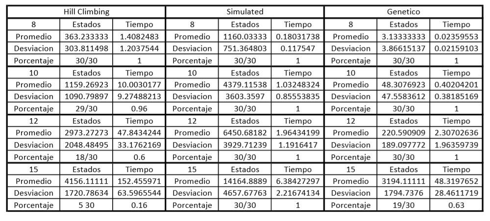

# Búsqueda Local 
Este trabajo practico se realizó respondiendo estas [consignas](https://docs.google.com/document/d/1Ocz9ZmOkIiVV7kgDguH99cpOWDKuxoKF6hwgtIv_NNQ/edit)

## Parte 1 
Se implementaron los algoritmos pedididos en los correspondientes archivos de python.

## Parte 2 

En la siguente tabla se muestra la comparacion de los promedios y desviaciones estandar que se obtubieron de cada algoritmo. Ademas se puede observar el porcentaje de veces que llegan a una solucion deseada es decir h = 0.

### Hill Climbing

### Simulated 

### Genético

## Conclusión
El algoritmo mas adecuado para la solucion es el simulated ya que obtiene un muy buen resultado en un tiempo significativamente menor. Esta diferencia se nota mas entre mayor sea el tablero.

## Exel utilizado
[Exel](https://1drv.ms/x/s!AnY8wEw8J95nhaoJ7RVpUzP_dBI_Jg)
